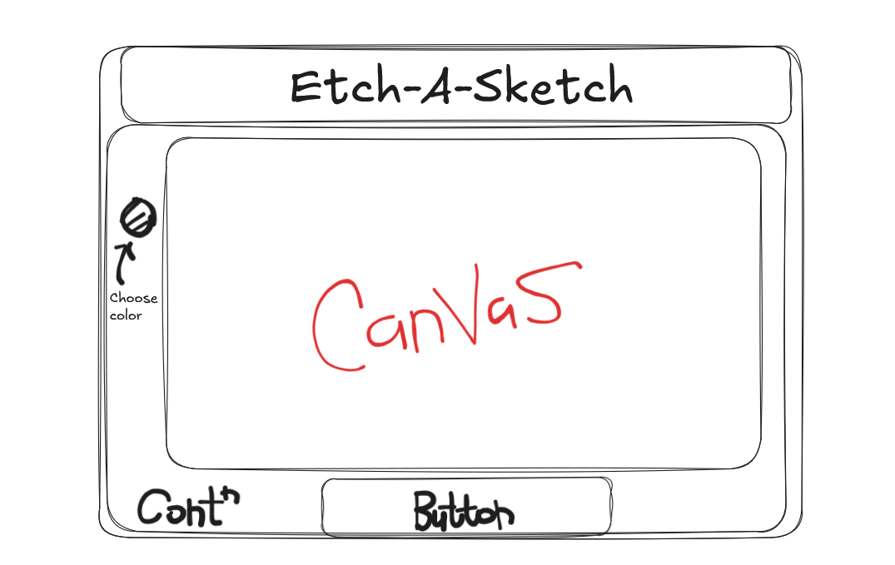
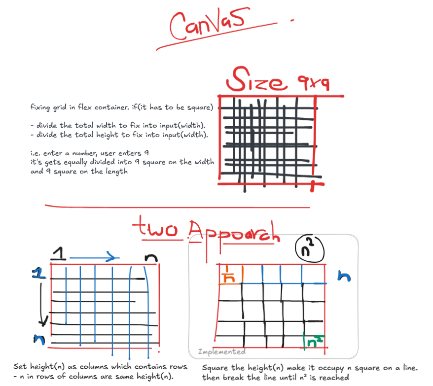
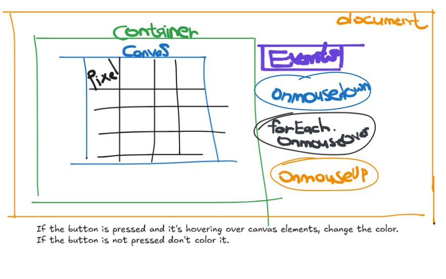
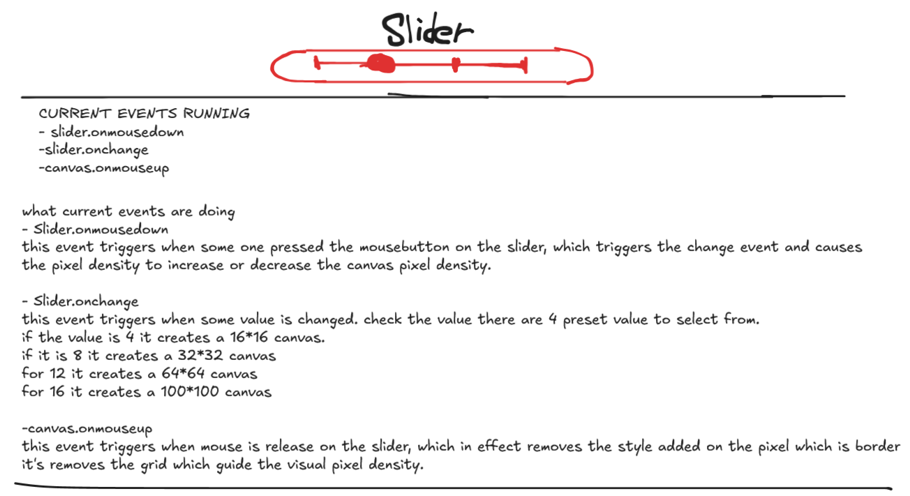
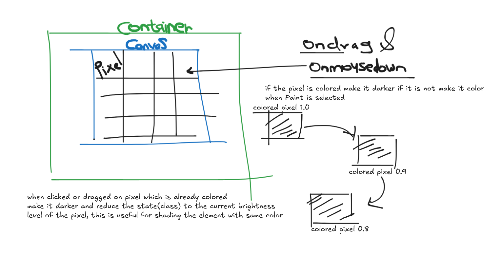

# Etch-a-Sketch
A simple canvas with feature like select paint draw and erase

live
[Link](https://dipakxb.github.io/Etch-a-Sketch/)

## Objective
 Select the canvas pixel density with slider then drag or click on pixels to paint them drag on a colored pixel to make it darker. remove paint from pixel with eraser tool

**Screenshot** ~ artist `chinmay bonde`
 

## Tech Stack
`Html` `Css` `JavaScript`

## Approach
First i needed a flow diagram to work on the things which matters in this application So i started with the main container which will hold everything.

then i choose a main container to keep every component together.
this container contain h1, buttons and canvas containers.

now we needed a canvas to paint on, I got two approaches to choose from

I chose the second approach which has take total pixel in
the canvas root `n` then add that to the row then wrap
until `n` square

The first method was take the total number of rows `n` make a column of it then add `n` times columns too.

I choose the second approach because we can access every element from the with the same class specifiers and add event listener which could target the same elements.

Then I needed a way to verify that the events are drag or click the canvas.
So i choose to delegate the `mouseover` event on `canvas` so it can handle if `mouseover` event is triggered on it's children `pixel`.

A flag which is on when another event `mousedown` is triggered on the canvas and off when `mouseup` on window, this flag controls the flow if `mousedown` and `mouseover` on pixels then paint.

mn                

Then i thought it is a good idea to add a slider to select the pixel density in the canvas,
added a function to set default value and to square the values and pass the result to the `initialize` function.

The specs has the feature to add a shading effect on clicking and dragging on the colored portion of the canvas.
I needed way to store the effect how dark it is 
I choose to store it as a class inside the pixel itself

